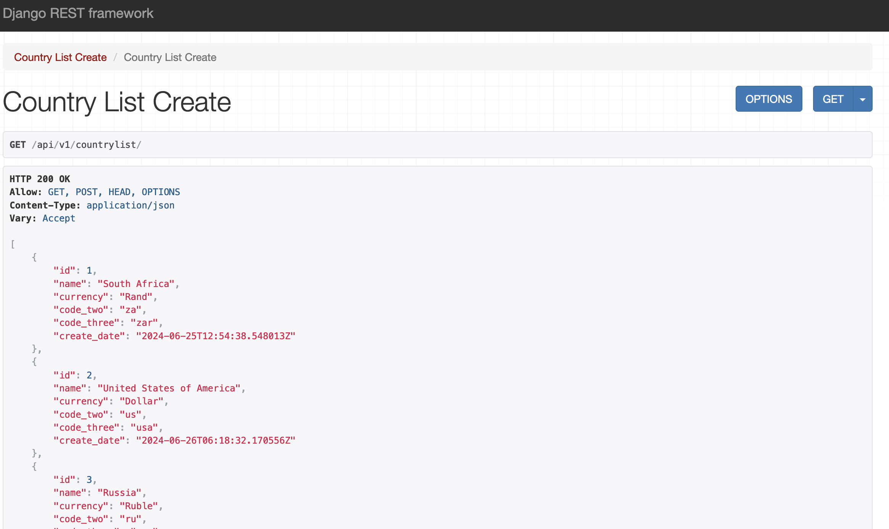
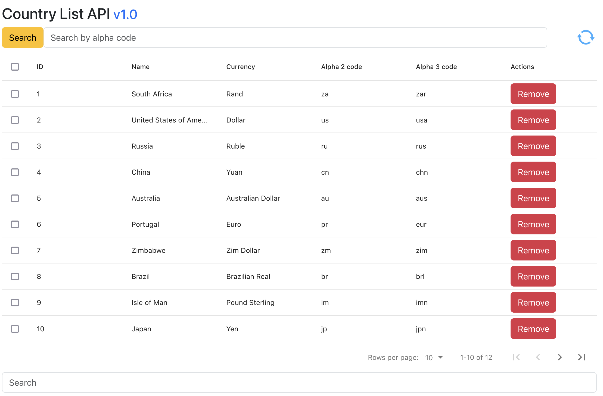

# FlowConnect Country List API v2.0

The company has a need for a standardised internal source of country information. 
This JSON REST API is built on the **Python Django 5.0** framework for the 
backend and a **React** frontend monorepo microservice to provide country information.


## Available endpoints

This API exposes these 4 RESTful endpoints for interaction. You may open these URLs from your favourite browser or via Postman (or similar app) for testing. Check out the next section on how to start the backend server.

```
/api/v1/countrylist/
```

Displays all countries. You may start adding country information from this endpoint.

```
/api/v1/countrylist/{id}/
```

Selects a single country by ID (database primary key). You may also **UPDATE** or **DELETE** an entry from this endpoint

```
/api/v1/countrylist/code/{alpha2 code}/
```

Selects a country by alpha 2 code specified (no **UPDATE/DELETE** actions allowed)

```
/api/v1/countrylist/alpha/{alpha3 code}/
```

Selects a country by alpha 3 code specified (no **UPDATE/DELETE** actions allowed)


## How to get up and running
### The manual way

Once all services have been cloned, run the python requirements file to set up the backend environment. Change dir into the **FlowConnect/backend** directory and run this command:

```
pip3 install -r requirements.txt (MacOs)
pip install -r requirements.txt (Windows)
```

Still inside the **FlowConnect/backend/** directory, run this command to start the Django/backened server:

```
python3 manage.py runserver (MacOs)
python manage.py runserver (Windows)
```

You should now be able to see a view similar to this one. This server will be listening to port 8000 by default, i.e. **http://localhost:8000**.




Once your backend is up and running, change into the frontend directory (**../frontend/**) and run these commands to boot up the frontend service.

```
npm install
npm start
```

Now open the front view from **http://localhost:3000** (default port should be 3000) and start interacting with the API. You should see a country list similar to the below.



### The dockerised way

This is the preferred way for a faster team colaboration environment. Run this command from the root dir of the project.
```
docker-compose up --build (version 1)
docker compose up --build (version 2)
```

Please note that your first build will take slighly longer as expected to set up the back and front end microservices.

After docker build has finished, you can access both microseverices independantly as above. Normally, an enduser will be given access to just the frontend part of the eco system!

## Acknowledgements

IBAN [Country codes](https://www.iban.com/country-codes)

IBAN [Country currencies](https://www.iban.com/currency-codes)

## License

Standard Readme follows the [Contributor Covenant](http://contributor-covenant.org/version/1/3/0/) Code of Conduct.

Copyright &copy; 2025
